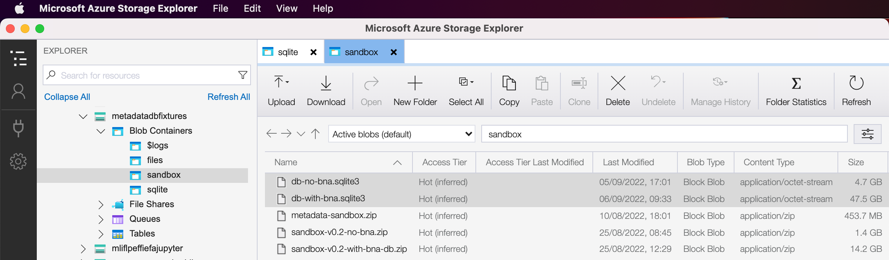

# Metadata database code

A package containing database access to the Living with Machines newspaper collection’s metadata.

## Installation

### Clone repository to local drive

Run the following command on your command line:

```
$ git clone git@github.com:Living-with-machines/lib_metadata_db.git
```

Follow by:

```
$ cd lib_metadata_db
```

Next, you will want to ensure that all the dependencies are installed and correctly up-to-date. 

### Dependencies

This project uses `poetry` as a package manager. You can read more about it at [`poetry-docs`](https://python-poetry.org/docs/). We recommend setting up `poetry` using `pyenv` to install specific versions of `python`, see [here](https://blog.jayway.com/2019/12/28/pyenv-poetry-saviours-in-the-python-chaos/) to manage python versions between local projects.

How to install the dependencies of the project?

```sh
$ poetry install
```

```sh
$ poetry poetry run metadata/manage.py shell_plus --notebook
```

### Put the database into place

Now you need to access the **correct** and **most up-to-date** version of the database and place that file into the correct 

**Correct version?** The correct version depends on whether you want to run the database with the entire collection (including BNA titles) or the more limited collection (excluding BNA titles).

**Most up-to-date version?** Make sure you access the latest database file. You will find it in the Azure storage space, under the `metadatadbfixtures` storage account and the `sandbox` blob container. ([Click this direct link to jump right to the correct container in the app.](storageexplorer://v=1&accountid=%2Fsubscriptions%2Fb8871872-a5e3-473f-b9b9-f4baaab6a9a0%2FresourceGroups%2Fmetadata%2Fproviders%2FMicrosoft.Storage%2FstorageAccounts%2Fmetadatadbfixtures&subscriptionid=b8871872-a5e3-473f-b9b9-f4baaab6a9a0&resourcetype=Azure.BlobContainer&resourcename=sandbox))

**Azure storage space?** Access it with the [Microsoft Azure Storage Explorer app](https://docs.microsoft.com/en-us/azure/vs-azure-tools-storage-manage-with-storage-explorer), or the [web portal](https://portal.azure.com/#home). You will notice that the file sizes for the database files are quite different in size:

[](docs/azure.png)

## Querying the database: Running the Django framework

In order to run the Django framework inside a notebook, the dependency management above has added functionality to easily start up the system:

In the folder where you find the `manage.py` file, run the following command:

```
$ python manage.py shell_plus --notebook
```

This should launch a normal Jupyter Notebook in your browser window where you can create any notebooks and access the database in different ways.

**Important:** Before importing any models and working with the database data, you will want to run the `import django_initialiser` in a cell, which will set up all the dependencies needed.

*Note:* The package comes with a `getting-started.ipynb` notebook and a `explore-newspapers.ipynb` notebook, which both will give some overview of how one can access the database’s information and what one can do with it. They only scratch the surface of what is possible, of course, but will be a good entry point for someone who wants to orient themselves toward the database and the Django syntax for querying.

## Upgrade development version

In order to upgrade the current development version that you have, make sure that you have synchronised the repository to your local drive, and that you have dropped the correct and most up-to-date `db.sqlite3` file into the same folder as the `manage.py` file. (See above, under ”Put the database into place“, for further explanation.)

**Step 1**: `git pull`

**Step 2**: `mv /path/to/updated-and-correct/db.sqlite3 /path/to/manage.py` — optionally, before you run this command, replace or rename the old db.sqlite3 file that may exist in the directory.

## Troubleshooting: Common issues

### `Error: ImproperlyConfigured: Requested setting INSTALLED_APPS, but settings are not configured.`

**Problem:** I have received an error that looks like this:

> ImproperlyConfigured&nbsp;&nbsp;&nbsp;&nbsp;&nbsp;&nbsp;&nbsp;&nbsp;&nbsp;&nbsp;&nbsp;&nbsp;&nbsp;&nbsp;&nbsp;&nbsp;&nbsp;&nbsp;&nbsp;&nbsp;&nbsp;&nbsp;&nbsp;&nbsp;&nbsp;&nbsp;&nbsp;&nbsp;&nbsp;&nbsp;&nbsp;&nbsp;&nbsp;&nbsp;&nbsp;&nbsp;&nbsp;&nbsp;&nbsp;Traceback (most recent call last)  
> ...  
> ImproperlyConfigured: Requested setting INSTALLED_APPS, but settings are not configured. You must either define the environment variable DJANGO_SETTINGS_MODULE or call settings.configure() before accessing settings.

**Explanation:** You have likely attempted to import any of the models (`Newspaper`, `Item`, `Entry`, etc.) and forgotten about the `import django_initialiser` statement that is required to set up Django in a Jupyter Notebook.

**Solution:** You must run `import django_initialiser` before you attempt to import any models from the Django package.

**If it does not work:** Are you running the notebook in the same folder as the `manage.py` script? Otherwise, try to move the notebook to that folder.

### `NameError: name 'Newspaper' is not defined`

**Problem:** I have received an error that looks like this:

> ---------------------------------------------------------------------------
> NameError&nbsp;&nbsp;&nbsp;&nbsp;&nbsp;&nbsp;&nbsp;&nbsp;&nbsp;&nbsp;&nbsp;&nbsp;&nbsp;&nbsp;&nbsp;&nbsp;&nbsp;&nbsp;&nbsp;&nbsp;&nbsp;&nbsp;&nbsp;&nbsp;&nbsp;&nbsp;&nbsp;&nbsp;&nbsp;&nbsp;&nbsp;&nbsp;&nbsp;&nbsp;&nbsp;&nbsp;&nbsp;&nbsp;&nbsp;Traceback (most recent call last)  
> ...  
> NameError: name 'Newspaper' is not defined

**Explanation:** You have likely forgotten to import the correct model before you tried to run a query on one of the newspapers (or whichever model you’re trying to access).

**Solution:** Run `from newspapers.models import Newspaper` or follow the same pattern for whichever model you want to import. (See the database schema if you are unsure which model you want to access.)

**If it does not work:** Are you running the notebook in the same folder as the `manage.py` script? Otherwise, try to move the notebook to that folder.
