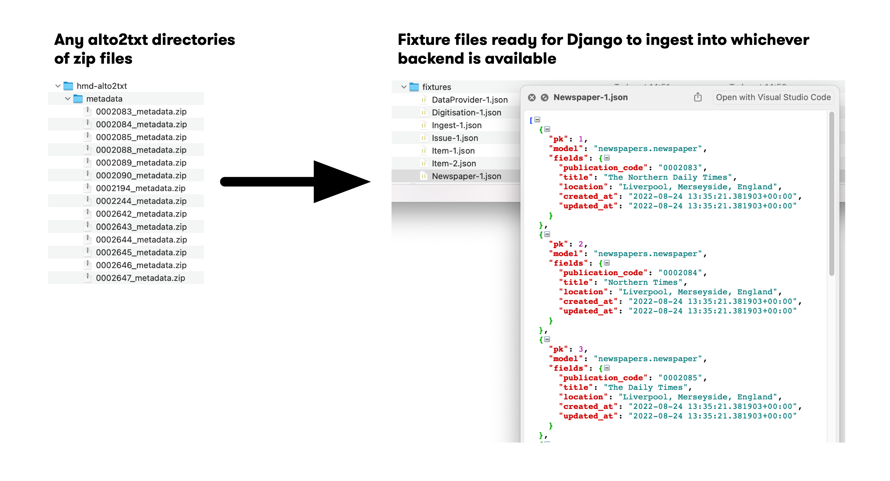

# alto2txt2fixture



`alto2txt2fixture` is a standalone tool that converts our alto2txt metadata into JSON data with corresponding relational IDs and corrected data for easy ingestion into a relational database.

## Running the program

```sh
$ py alto2txt2fixture.py
```

### Optional parameters

The program has a number of optional parameters that you can choose to include or not. The table below describes each parameter, how to pass it to the program, and what its defaults are.

| flag              | Description                                                    | Default value       |
| ----------------- | -------------------------------------------------------------- | ------------------- |
| -c, --collections | Which collections to process in the mounted alto2txt directory | hmd, lwm, jisc, bna |
| -o, --output      | Into which directory should the processed files be put?        | `../fixture`        |
